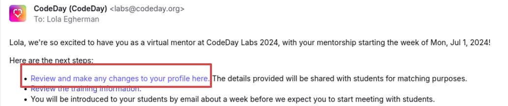
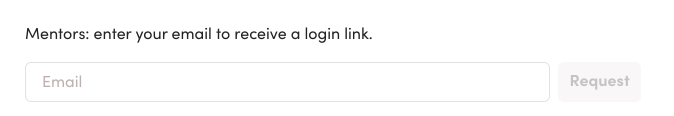

# CodeDay Labs Mentor Dashboard

# Accessing Your Mentor Dashboard

At the start of every program, you will get an email with a link to your **CodeDay Labs Mentor Dashboard:**

(In plaintext, these links look like `https://labs.codeday.org/dash/m/eyJ[...]` )

This is a **permissioned link** (so please don’t share it!) that will work through the entire session. We recommend saving it to your browser’s bookmarks for easy access. 

If you ever lose the link to your dashboard, you can request a new one on [labs.codeday.org/dash](https://labs.codeday.org/dash): 

# Using Your Mentor Dashboard

Your mentor dashboard is the source of truth for:

- Key program dates
- Your assigned CodeDay Staff contact
- Who your interns are (once assigned)
- Your team’s open source issue (once assigned)

## Updating Your Mentor Profile

Your mentor dashboard is how you can update your mentor profile. This information (outside of project preferences) is sent to your interns so they can get to know you after matching.

If you’ve mentored before, CodeDay will automatically copy over your profile from prior sessions so you don’t need to fill it out again. You’re still welcome to update it if any of your information has changed since the last time you mentored!

### Project Preferences

If you have specific requests for the type of project you would like to be matched with, you can express them here. These are only shared with program staff. We will do our best to accommodate your preferences but are unable to make any guarantees.

{: .note }

> Information you share in your mentor dashboard is stored securely on CodeDay’s servers, and will never be sold. Details: [https://www.codeday.org/privacy](https://www.codeday.org/privacy)