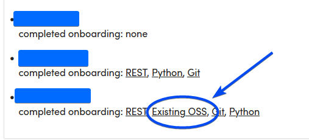

# Mentor Training

{: .new-title }
> First-time mentor?
>
> We *highly recommend* reading this guide in it’s entirety. 
> We know your time is valuable and we’ve done everything we can to keep it brief - it should only take 20-30 minutes.

  

    Table of contents
  

  {: .text-delta }
1. TOC
{:toc}

## **Welcome to CodeDay Labs**

Many students struggle to transition from coursework to professional software development due to limited exposure to critical industry skills, such as:

- Setting up and running real production development environments
- Navigating large, distributed codebases that no single developer fully understands
- Collaborative engineering workflows
- Making practical engineering decisions under ambiguity

**CodeDay Labs** is a structured mentorship program that connects students with real open-source and industry-aligned projects, supported by experienced mentors (that’s you!)

Mentors like you are coming together to help thousands of students succeed. So we'd like to share a sincere: **thank you!**

{: .note-title }
> ❤️
>
> If you'd like to provide some additional help, please consider sharing more about CodeDay Labs with your connections on LinkedIn. We're in urgent need of more mentors. The link to share is: [https://labs.codeday.org/mentor](https://labs.codeday.org/mentor)

# Getting Started

{: .important }
> This training contains a few CodeDay-specific terms. While most can be inferred from context, you can get a definition of them here:
> [Glossary](glossary.md) 

## Program Format

An Industry Mentor (that’s you!) guides a team of 2-4 interns as they work on solving an open source issue. CodeDay will pick and assign the issue from partnerships we’ve built with various open source projects. 

Industry Mentors provide **high-level guidance** and share common problem solving techniques.

At any time, Interns can schedule a meeting with one of CodeDay’s Consulting Software Engineers, who give lower level, more technical guidance and debugging help.

CodeDay Labs can be one of two lengths:

**Microinternship** - 4 weeks (3 mentored)

**Summer Open Source Experience** - 8 weeks (7 mentored)

## Time Commitment

Being a CodeDay Labs Industry Mentor is a **1hr/week** time commitment, consisting of:

- Meeting weekly with your team (**45min-1hr,** scheduled at your availability)
- Filling out a feedback form evaluating your Interns. (**5-10min**)

## First Steps

Before the start of the program, please do the following

- Review the mentor training
    - If you are a **first-time mentor**: please *read the training in it’s entirety*
    - If you are a **returning mentor**: you don’t need to read the whole training again, but we recommend at least taking a quick look to jog your memory and make sure you’re up to date on current policies.
- Make sure you have access to your [CodeDay Labs Mentor Dashboard](./dashboard.md), and confirm the following:
    - The information on your mentor profile is correct.
    - Double-check the listed program dates with your calendar.
    [What do I do if I have a scheduling conflict?](./scheduling.md)
- (optional) Join the CodeDay Slack.
    - Slack is the preferred mode of communication for talking to your Interns and CodeDay Staff.
    - CodeDay will automatically send Slack invites near the start of the program.
    - We send invites to the email listed on your mentor dashboard, please contact your CodeDay staff contact if you need an invite sent to a different email address.
    - Each team will have their own slack channel, as well as a channel for all the mentors of your cohort.

# Weeks -1, 0, and 1

## Getting to Know Your Team

You'll be introduced to your Interns a few days before the start of the program.

We know you may want to reach out earlier so you can hit the ground running, but we won't have the final list of matches until close to the start. Don't worry: we've built the ramp-up time into the program.

When we introduce you to your interns, we'll ask everyone to introduce themselves so you can get to know your team, and they can get to know you. Your interns will have seen your position, company, and bio (as listed in your mentor profile) but that’s not a whole ton to go off of! We encourage taking time in your first meeting to introduce yourself more thoroughly and get to know your team.

## Intern Commitment

All CodeDay Labs Interns have committed to spending at least 10 hours a week on the program, including meetings with you.

(Many interns have committed 20 or 30 hours a week, in which case we'll try to keep your group to interns who can spend a similar amount of time.)

While output quality would be improved if interns could spend more time, many interns have to work part-time jobs to pay for school or support their families. We ask that you be respectful of the amount of time interns committed to when you review progress. Please also consider that it’s likely the first time your interns have worked on a coding project outside of school, and potentially the first time working on a project that contains more than one file.

[What progress should I expect my Interns to make each week?](./progress.md) 

In addition to their time commitment, your interns have agreed to:

- Be available to schedule meetings during the daytime in their local timezone. (Which will be close to your timezone unless you indicated otherwise in your profile.)
- Respond to emails in a timely manner, make scheduled meetings, and be a reliable team member.

Each week, we'll ask you to describe your interns’ progress, and quickly let us know how they are doing in meeting these commitments. If there's a problem, we encourage you to bring it up directly or during a group meeting. However, we'll also be checking in with interns who are falling behind so you don't need to. 

## Onboarding Week

 Before mentoring starts, your interns have one week of onboarding, where they learn/review relevant technologies needed for working on your teams assigned issue.

**Onboarding week is unmentored,** you are not expected to meet with your interns until the week after onboarding.

As always, you can review key dates and deadlines (such as when mentoring starts) in your [CodeDay Labs Mentor Dashboard](./dashboard.md) 

## Scheduling Your First Meeting

Once you’re introduced to your interns, it’s your responsibility to schedule the first meeting. Our software will do its best to suggest common meeting times based on interns’ listed availability, but if none of those times work CodeDay recommends using [https://when2meet.com](https://when2meet.com) for communicating availability (you may optionally read the [When2Meet Guide](./when2meet-guide.md) on how to use it).

CodeDay has no requirements for what meeting platform to use, however we’d recommend a common one (such as Google Meet, Zoom, or a Slack huddle) so it’s closer to what interns can expect in the workplace. 

## Preparing For Your First Meeting

{: .new-title }
>🥳 **You don’t have to do anything to prepare for your first meeting!**
>
>During onboarding week, your interns will each create their own agenda for the first meeting, following [this template](https://docs.google.com/document/d/1bvYIzNpyHObd5_Wu3kFbfYkmMgNYmssdAFxAXo67jc8/edit?usp=sharing). You can see your interns submitted agendas in your mentor dashboard:
>

During the first meeting, your objectives should be:

- Get to know your interns
- Share background on yourself and your career
- Go over each intern’s agenda, and provide high-level feedback on their approach
- Schedule future meetings

# Your Role as Mentor

As an Industry Mentor, your role is to give **high level guidance**, not direct instruction. Most industry programmers are constantly learning, but for some students, the structure of schools leads them to believe that once they get their degree, they will "know" programming.

To help your interns learn to learn, we encourage you to use **Socratic Questioning** when dealing with questions:

- **Practice rubber-duck debugging.** Have them explain what the problem is, how their code works, etc.
- **Ask leading questions.** For example, "What have you tried searching for? Do you have any ideas for how we can solve this problem?"
- **Give next steps (not answers).** If your interns need more guidance, instead of giving a direct answer, help by narrowing down a problem or pointing them at a resource.

Broadly, most conversations with your interns should go as follows:

**Intern:** “I can’t figure out [problem]”

**Mentor: “**I don’t know the fix ¯\\\_(ツ)_/¯
  here are the steps I would take to figure it out, though!”

While this is best for CodeDay Labs interns, they often expect their mentor to be a subject matter expert, giving direct answers to any question asked. If your interns get hung up on a specific technical detail, bug, or question, encourage them to schedule a CSE session.

## Sharing Industry Practices

Team meetings are a good time to share techniques used in industry which aren't taught in many CS classes.

If you have experience in these topics, and they're relevant to the assigned issue, we encourage you to discuss these topics with your team at some point during CodeDay Labs:

- Collecting metrics, A/B testing, and data-driven-design
- Code reviews; git/collaboration workflows
- CI/CD, and modern deployment (containerization, cloud computing)
- Testing
- Systems thinking
- Presentation skills; presenting technical ideas to non-technical people

## Being Culturally Responsive

CodeDay Labs attracts a very diverse group of participants. While we aim to match you with interns you'll click with, it's likely your interns' backgrounds may be different from yours.

These differences are important not only to how we communicate, but also in shaping thinking (it's easiest, for example, to understand a new concept in the context of an existing one).

Your interns will feel most comfortable, learn best, and achieve highest when we try to include their cultural references in discussions and learning. (This is called **Culturally Responsive Teaching** in the classroom.)

As you get to know your interns in your first meetings, strive to understand how their cultural background may differ from yours:

- **Internal Factors**
    - Ethnicity
    - Ability
    - Age
    - Gender
    - Sexual Orientation
    - Race
    - Religion
    - Socioeconomic Status
- **External Factors**
    - Language
    - Appearance
    - Educational Attainment
    - Geographic Location
- **Institutional Factors**
    - Status
    - Seniority
    - School Location
    - Clubs, Affiliations

# Additional Reading

[If Your Interns Finish Early…](./if-finish-early.md)

[CodeDay Labs Mentor Dashboard](./dashboard.md)

[When2Meet Guide](./when2meet-guide.md)

{: .note-title }
>**Confused? Have a question?**
>
>CodeDay is here to help! Reach out to your dedicated CodeDay contact, as listed in your [CodeDay Labs Mentor Dashboard](./dashboard.md) 